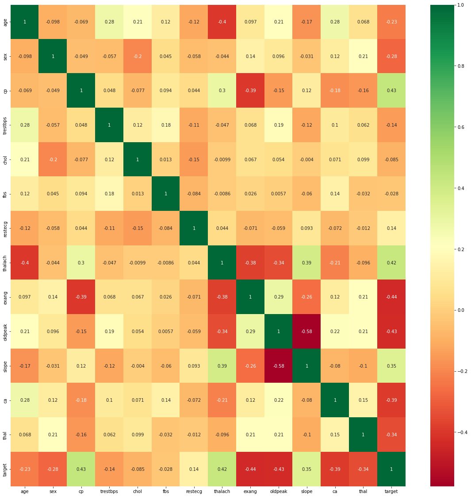
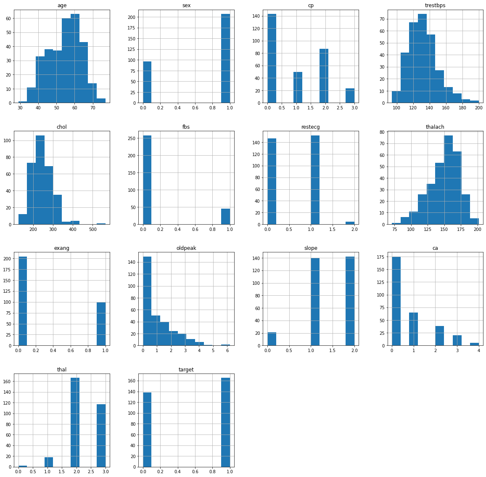
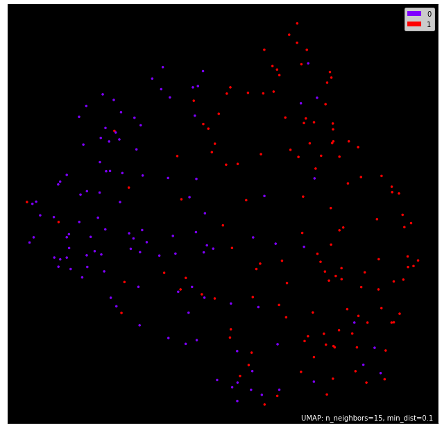
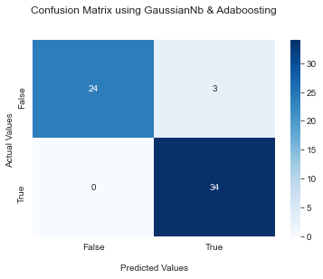
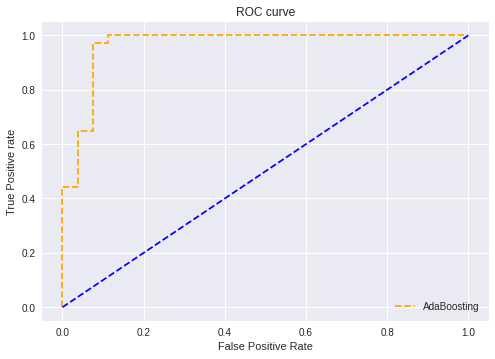
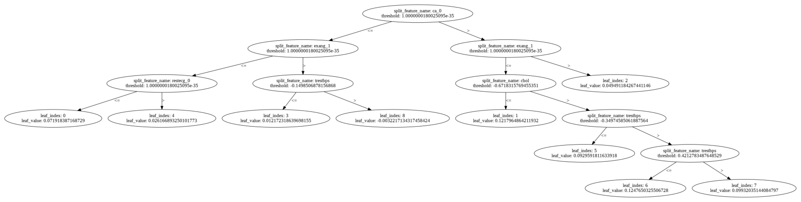
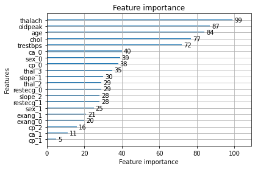

# Predicting Heart Disease

For machine learning project, I chose to build a binary classifier to predict [heart disease](https://www.kaggle.com/danimal/heartdiseaseensembleclassifier). Because this model has healthcare applications, the emphasis is on recall rather than accuracy or precision when evaluating model performance. I explore a variety of relatively simple classifiers (read: no neural networks)––Support Vector Machines, Decision Trees and Random Forests, AdaBoost and XGBoost, KNN, naive bayes, gradientboosting––and fine tune each to upwards of 85% recall on test data. My final model, an ensemble model of AdaBoost hypertunning with GuassianNB, combines some of the best models to achieve 95% recall on test data.

## EDA and Preprocessing

Of the raw data of 303 patients, no null values ;

The original labels, ranging from 0, no heart disease, to 4, the most advanced stage of heart disease, were redesigned to range from `0`, no heart disease, and the original values of 1, 2, 3, and 4 were squished into a single category, `1`, "presence of heart disease."

Features were standardized and then analyzed for correlation among each other using a Pearson correlation heatmap. Simultaneously, a random forest was trained to evaluate feature importance, with `thalach`, `cp`, `thal`, and `ca` taking the top four spots.

none of my features are so highly correlated with each other. I keep the next seven most significant features, none of which are egregiously correlated with each other, for my final set of features.

**Understanding the train dataset** here i used Umap to plot the dataset in 2D graph

## Model Training

Models were evaluated primarily for their recall, given the healthcare setting, while still trying to maintain modestly high accuracy and precision. Nine models were trained.
The model predicted heart disease––which featured ~0.96 recall while still retaining a relative maximum in accuracy ~0.95. Confusion matrices for before and after threshold installed below.

### Hare also i used ROC_Curve to understand the reslut more better

### Our model LGBM also have same accuracy and confussion matrix so the decision tree of LGBM is -

### And also the Feature importance of LGBM is :

## Results

| Model | Final Test Accuracy |
|-|-|
| **AdaBoost (Base = GuassianNB)** | **95%** |
| Linear SVC | 93.4% |
| GuassianNB | 88.5% |
| BernoulliNB | 88.5% |
| Decision Tree | 95% |
| Random Forest | 95% |
| AdaBoost (Base = Decision Tree) | 95% |
| GradientBoost | 93.4% |
| XGBoost | 93.4% |
| KNN | 88.5% |
| **LGBM** | **95%** |

## Conclusions

By (1) list-wise removing missing data; (2) converting the classification problem to a binary one and standardizing features; and (3) manually setting the probability threshold for disease detection to 0.35, I was able to achieve **0.96 recall** and **0.95 accuracy** from my best model, a soft voting ensemble classifier made up of a guassianNB, and an AdaBoost classifier. Also i have choose this model because of the confusion matrix which is more better than other nodels.

## Libraries

Standard packages for data analysis and visualization are required–[NumPy](https://numpy.org/), [Pandas](https://pandas.pydata.org/), [Matplotlib](https://matplotlib.org/), and [Seaborn](https://seaborn.pydata.org/), [scikit-learn](https://scikit-learn.org/stable/index.html) for a number of classifiers, and [XGBoost](https://xgboost.readthedocs.io/en/latest/).

## Contributing

Due to the nature of the project, this project is not open to contributions. If, however, after looking at the project you'd like to give advice to someone new to the field and eager to learn, please reach out to me at [rajarshi921@gmail.com]

## Author

**Rajarshi SinhaRoy**  

## Acknowledgments
Thanks to [Kaggle](https://www.kaggle.com) for access to data found in [Heart Disease Ensemble Classifier](https://www.kaggle.com/danimal/heartdiseaseensembleclassifier)
